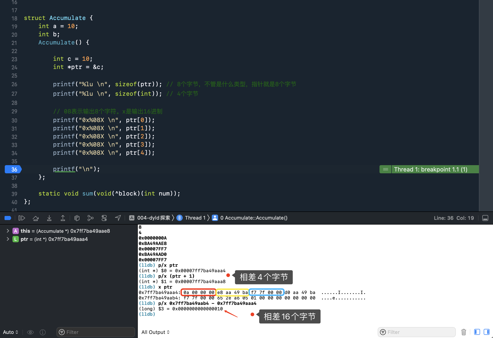
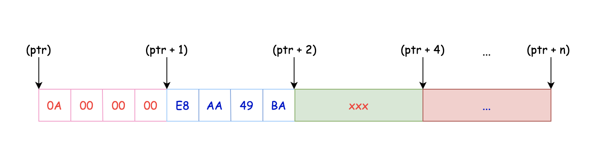

## C++枚举类型enum与enum class

通常情况下，我们定义一个枚举类型：

```cpp
enum Sex {
 Girl,  
 Boy 
};
```
这时，你不可以再使用一个枚举去定义Girl 和 Boy了，如：

```cpp
// 错误，编译器提示 Girl，Boy重定义
enum Student {
 Girl,  
 Boy 
};
```
编译错误的原因在于Sex与Student都处在同一作用域下，成员变量重定义。这便体现C++11引入枚举类(enum class)的重要性，enum class能够有效对枚举作用域进行限定，避免了枚举成员的重定义：

```cpp
enum class Sex {
 Girl,  
 Boy 
};
 
enum class Student {
 Girl,  
 Boy 
};
 
int main(int argc, char *argv[]) {
 //两者处于不同作用域下，不会重定义
 Sex a = Sex::Gril; 
 Student b = Student::Gril;
}
```

## appendNumber函数

```c++
static void appendDigit(char*& s, unsigned& num, unsigned place, bool& startedPrinting)
{
    if ( num >= place ) {
        unsigned dig = (num/place);
        *s++ = '0' + dig;
        num -= (dig*place);
        startedPrinting = true;
    }
    else if ( startedPrinting ) {
        *s++ = '0';
    }
}

// 最多剔除前面5个字符
static void appendNumber(char*& s, unsigned num)
{
    assert(num < 99999);
    bool startedPrinting = false;
    appendDigit(s, num, 10000, startedPrinting);
    appendDigit(s, num,  1000, startedPrinting);
    appendDigit(s, num,   100, startedPrinting);
    appendDigit(s, num,    10, startedPrinting);
    appendDigit(s, num,     1, startedPrinting);
    if ( !startedPrinting )
        *s++ = '0';
}
```

测试代码:

```c++
int main() {
    char *ss = (char *)malloc(8);
    strcpy(ss, "huang11"); // \0
    unsigned num = 1000; // 剔除前面4位字符
    appendNumber(ss, num);
    printf("%s\n", ss); // g11
}
```


## C++中支持Block

```c
// 定义函数
struct Accumulate {
    static void sum(void(^block)(int num));
};

// 实现函数
void Accumulate::sum(void(^block)(int num)) {
    block(20);
}
```

## 指针补充

### 案例一

```c++
struct Accumulate {
    int a;
    int b;
    Accumulate() {
        printf("%lu \n", (char *)this); // 起始地址
        printf("%lu \n", &a); // 其实就是起始地址
        
        printf("%lu \n", &b); // b的地址
        printf("%lu \n", (char *)this + sizeof(a)); // b的地址
        
        printf("%lu \n", sizeof((char *)this)); // 8个字节
    };
};
```

结果

```c
140702011480808 
140702011480808 
140702011480812 
140702011480812 
8 
```

### 案例二

```c++
void MachOFile::forEachLoadCommand(Diagnostics& diag, void (^callback)(const load_command* cmd, bool& stop)) const {
      // ...
      const uint32_t* h = (uint32_t*)this;
      diag.error("file does not start with MH_MAGIC[_64]: 0x%08X 0x%08X", h[0], h [1]);
      return;
      // ...
 }
```

比较困惑的是指针也可以取索引吗？



画图说明



> 指针 **ptr** 指向的是 **int** 类型，所以每次指针 **ptr** 移动时都是以 **int** 字节数为单位的！

所以上述代码等同于下面：

```c++
printf("0x%08X \n", ptr[0]);
printf("0x%08X \n", *ptr);

printf("0x%08X \n", ptr[1]);
printf("0x%08X \n", *(ptr + 1));

printf("0x%08X \n", ptr[2]);
printf("0x%08X \n", *(ptr + 2));

printf("0x%08X \n", ptr[3]);
printf("0x%08X \n", *(ptr + 3));

printf("0x%08X \n", ptr[4]);
printf("0x%08X \n", *(ptr + 4));
```

